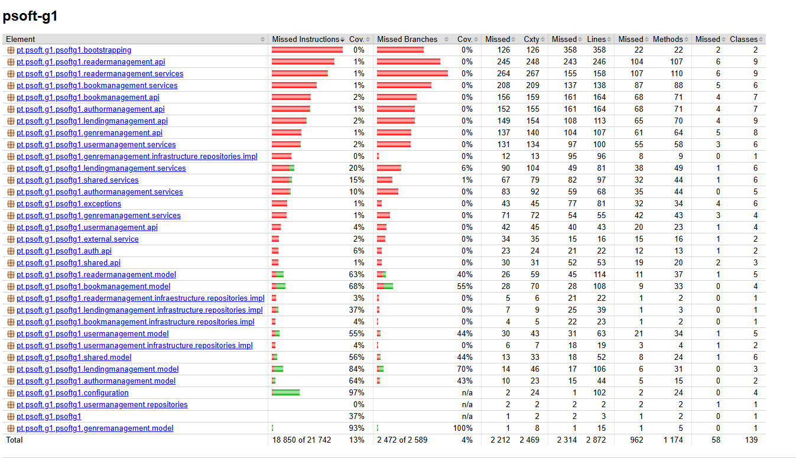

# 1. Summary Table

| Active Test                                                   | Average Test Quality | Code                              | Detailed Table                        | Path                                      |
|:--------------------------------------------------------------|:--------------------:|:---------------------------------:|:--------------------------------------|:------------------------------------------|
| Test 01 - `ensureNameNotNull()`                               |          10          | [View Code](#code-of-test-01)     | [View Table](#detailed-table-test-01) | AuthorTest.java                           |
| Test 02 - `ensureBioNotNull()`                                |          10          | [View Code](#code-of-test-02)     | [View Table](#detailed-table-test-02) | AuthorTest.java                           |
| Test 03 - `whenVersionIsStaleItIsNotPossibleToPatch()`        |          10          | [View Code](#code-of-test-03)     | [View Table](#detailed-table-test-03) | AuthorTest.java                           |
| Test 04 - `testCreateAuthorWithoutPhoto()`                    |          10          | [View Code](#code-of-test-04)     | [View Table](#detailed-table-test-04) | AuthorTest.java                           |
| Test 05 - `testCreateAuthorRequestWithPhoto()`                |          10          | [View Code](#code-of-test-05)     | [View Table](#detailed-table-test-05) | AuthorTest.java                           |
| Test 06 - `testCreateAuthorRequestWithoutPhoto()`             |          10          | [View Code](#code-of-test-06)     | [View Table](#detailed-table-test-06) | AuthorTest.java                           |
| Test 07 - `testEntityWithPhotoSetPhotoInternalWithValidURI()` |          10          | [View Code](#code-of-test-07)     | [View Table](#detailed-table-test-07) | AuthorTest.java                           |
| Test 08 - `ensurePhotoCanBeNull_AkaOptional()`                |         8,13         | [View Code](#code-of-test-08)     | [View Table](#detailed-table-test-08) | AuthorTest.java                           |
| Test 09 - `ensureValidPhoto()`                                |          10          | [View Code](#code-of-test-09)     | [View Table](#detailed-table-test-09) | AuthorTest.java                           |
| Test 10 - `whenFindByName_thenReturnAuthor()`                 |         9,75         | [View Code](#code-of-test-10)     | [View Table](#detailed-table-test-10) | AuthorRepositoryIntegrationTest.java      |
| Test 11 - `testSave()`                                        |          10          | [View Code](#code-of-test-11)     | [View Table](#detailed-table-test-11) | LendingRepositoryIntegrationTest.java     |
| Test 12 - `whenValidId_thenAuthorShouldBeFound()`             |         8,75         | [View Code](#code-of-test-12)     | [View Table](#detailed-table-test-12) | AuthorServiceImplIntegrationTest.java     |
| Test 13 - `testSetReturned()`                                 |          10          | [View Code](#code-of-test-13)     | [View Table](#detailed-table-test-13) | LendingServiceImplTest.java               |
| **Average Total Quality**                                     |        **9,74**      |                                   |                                       |                                           |
| **Total Test Coverage (%)**                                   |      **13,3%**       |                                   |                                       | JaCoCo instruction coverage, full suite   |

The sample is 13 active tests. It is not the whole suite. The average is the mean of the 13 test averages.

JaCoCo measured the instruction coverage of the whole active suite at 13,3%. The figure is low: the domain packages are partly covered, while the API, the services and the bootstrapping stay near 0%.




# 2. Measurements to quality of tests

### Evaluation

Each test was run 3 times in a row with Maven Surefire, on 9 October 2026, with Java 21. Every run passed. Times below are the Surefire time of the test method, in ascending order.

Scores use a scale from 0 to 10:

- **0** - completely unsatisfactory
- **10** - fully satisfactory

| Measurement            | Definition                                                     |
|:-----------------------|:---------------------------------------------------------------|
| 1. Functional Coverage | Does the test verify the expected behavior accurately?         |
| 2. No Duplication      | Does the test avoid repeating logic or cases already covered?  |
| 3. Reproducibility     | Does the test produce the same result in any environment?      |
| 4. Clarity             | Is the test name easy to understand the objective?             |
| 5. Independence        | Is the test isolated, does not depend or affect others?        |
| 6. Performance         | Does the test run quickly?                                     |
| 7. Flakiness           | Is the test stable - does not fail randomly?                   |
| 8. Maintainability     | Is it easy to update the test if production code changes?      |

## Target Ranges for Test Quality Metrics

| Measurement            | Target                                                                                  |
|:-----------------------|:----------------------------------------------------------------------------------------|
| 1. Functional Coverage | Test accomplish the objective? (0 or 10)                                                |
| 2. No Duplication      | Test is duplicated, or is unique? (0 or 10)                                             |
| 3. Reproducibility     | Test produces the same result in 3 consecutive runs on this PC. (0 or 10)               |
| 4. Clarity             | Test name and purpose are clearly described? (0 or 10)                                  |
| 5. Independence        | The test under study affects other tests? (0 or 10)                                     |
| 6. Performance         | Test duration. (0.0-0.3s = 10; 0.3-0.6s = 9; 0.6-0.9s = 8; 0.9-1.2s = 7; above 3s = 3) |
| 7. Flakiness           | Test fails in any of the 3 consecutive executions? (0 or 10)                            |
| 8. Maintainability     | Average of No Duplication and Independence.                                             |

Coverage was measured with JaCoCo 0.8.12 on the full active suite (102 tests). Instruction coverage is 2 892 of 21 742 instructions, which is 13,3%. Line coverage on the same run is 558 of 2 872 lines, which is 19,4%. The summary uses the instruction figure, which is JaCoCo's main counter.

---

## {#detailed-table-test-01}

| Measurement            | Score (0-10) | Comments                                                                                          |
|:-----------------------|:-------------|:--------------------------------------------------------------------------------------------------|
| 1. Functional Coverage | 10           | `Author(null, ...)` throws `IllegalArgumentException`. The name cannot be null.                  |
| 2. No Duplication      | 10           | This null-name case is not repeated.                                                              |
| 3. Reproducibility     | 10           | Same result in 3 consecutive runs.                                                                |
| 4. Clarity             | 10           | The name states the objective.                                                                    |
| 5. Independence        | 10           | Creates no shared state.                                                                          |
| 6. Performance         | 10           | 32 ms, 32 ms, 39 ms. Average about 34 ms.                                                         |
| 7. Flakiness           | 10           | Did not fail in any of the 3 runs.                                                                |
| 8. Maintainability     | 10           | Average of No Duplication and Independence.                                                       |

## {#detailed-table-test-02}

| Measurement            | Score (0-10) | Comments                                                                 |
|:-----------------------|:-------------|:-------------------------------------------------------------------------|
| 1. Functional Coverage | 10           | `Bio` passed as null throws `IllegalArgumentException`.                  |
| 2. No Duplication      | 10           | This null-bio case is not repeated.                                     |
| 3. Reproducibility     | 10           | Same result in 3 consecutive runs.                                       |
| 4. Clarity             | 10           | The name states the objective.                                           |
| 5. Independence        | 10           | Creates no shared state.                                                 |
| 6. Performance         | 10           | 1 ms, 1 ms, 1 ms.                                                        |
| 7. Flakiness           | 10           | Did not fail in any of the 3 runs.                                       |
| 8. Maintainability     | 10           | Average of No Duplication and Independence.                              |

## {#detailed-table-test-03}

| Measurement            | Score (0-10) | Comments                                                                                          |
|:-----------------------|:-------------|:--------------------------------------------------------------------------------------------------|
| 1. Functional Coverage | 10           | `applyPatch` with a stale version throws `StaleObjectStateException`.                            |
| 2. No Duplication      | 10           | Unique case.                                                                                      |
| 3. Reproducibility     | 10           | Same result in 3 consecutive runs.                                                                |
| 4. Clarity             | 10           | The name states the objective.                                                                    |
| 5. Independence        | 10           | Builds its own `Author`.                                                                          |
| 6. Performance         | 10           | 1 ms, 1 ms, 2 ms.                                                                                 |
| 7. Flakiness           | 10           | Did not fail in any of the 3 runs.                                                                |
| 8. Maintainability     | 10           | Average of No Duplication and Independence.                                                       |

## {#detailed-table-test-04}

| Measurement            | Score (0-10) | Comments                                                                 |
|:-----------------------|:-------------|:-------------------------------------------------------------------------|
| 1. Functional Coverage | 10           | An `Author` created with a null photo is not null and has no photo.     |
| 2. No Duplication      | 10           | This is the direct constructor case. Test 08 repeats only the photo check. |
| 3. Reproducibility     | 10           | Same result in 3 consecutive runs.                                       |
| 4. Clarity             | 10           | The name states the objective.                                           |
| 5. Independence        | 10           | Builds its own `Author`.                                                 |
| 6. Performance         | 10           | 69 ms, 69 ms, 71 ms. Average about 70 ms.                                |
| 7. Flakiness           | 10           | Did not fail in any of the 3 runs.                                       |
| 8. Maintainability     | 10           | Average of No Duplication and Independence.                              |

## {#detailed-table-test-05}

| Measurement            | Score (0-10) | Comments                                                                                          |
|:-----------------------|:-------------|:--------------------------------------------------------------------------------------------------|
| 1. Functional Coverage | 10           | An author built from a `CreateAuthorRequest` keeps the photo URI.                                |
| 2. No Duplication      | 10           | This is the request-with-photo case. Test 09 checks the `Photo` object on the constructor.       |
| 3. Reproducibility     | 10           | Same result in 3 consecutive runs.                                                                |
| 4. Clarity             | 10           | The name states the objective.                                                                    |
| 5. Independence        | 10           | Builds its own request and `Author`.                                                              |
| 6. Performance         | 10           | 1 ms, 1 ms, 2 ms.                                                                                 |
| 7. Flakiness           | 10           | Did not fail in any of the 3 runs.                                                                |
| 8. Maintainability     | 10           | Average of No Duplication and Independence.                                                       |

## {#detailed-table-test-06}

| Measurement            | Score (0-10) | Comments                                                                 |
|:-----------------------|:-------------|:-------------------------------------------------------------------------|
| 1. Functional Coverage | 10           | A request without a photo URI produces an author with no photo.         |
| 2. No Duplication      | 10           | Unique because it goes through `CreateAuthorRequest`, not only the constructor. |
| 3. Reproducibility     | 10           | Same result in 3 consecutive runs.                                       |
| 4. Clarity             | 10           | The name states the objective.                                           |
| 5. Independence        | 10           | Builds its own request and `Author`.                                     |
| 6. Performance         | 10           | 1 ms, 1 ms, 1 ms.                                                        |
| 7. Flakiness           | 10           | Did not fail in any of the 3 runs.                                       |
| 8. Maintainability     | 10           | Average of No Duplication and Independence.                              |

## {#detailed-table-test-07}

| Measurement            | Score (0-10) | Comments                                                                 |
|:-----------------------|:-------------|:-------------------------------------------------------------------------|
| 1. Functional Coverage | 10           | `EntityWithPhoto.setPhoto` stores a valid URI.                          |
| 2. No Duplication      | 10           | Unique case. It uses a local subclass, not `Author`.                    |
| 3. Reproducibility     | 10           | Same result in 3 consecutive runs.                                       |
| 4. Clarity             | 10           | The name states the objective.                                           |
| 5. Independence        | 10           | Builds its own object.                                                   |
| 6. Performance         | 10           | 0 ms, 1 ms, 1 ms.                                                        |
| 7. Flakiness           | 10           | Did not fail in any of the 3 runs.                                       |
| 8. Maintainability     | 10           | Average of No Duplication and Independence.                              |

## {#detailed-table-test-08}

| Measurement            | Score (0-10) | Comments                                                                                          |
|:-----------------------|:-------------|:--------------------------------------------------------------------------------------------------|
| 1. Functional Coverage | 10           | The photo of an `Author` can be null.                                                            |
| 2. No Duplication      | 0            | Same outcome as `testCreateAuthorWithoutPhoto`: an author with a null photo has `getPhoto() == null`. |
| 3. Reproducibility     | 10           | Same result in 3 consecutive runs.                                                                |
| 4. Clarity             | 10           | The name states the objective.                                                                    |
| 5. Independence        | 10           | Builds its own object.                                                                            |
| 6. Performance         | 10           | 1 ms, 2 ms, 2 ms.                                                                                 |
| 7. Flakiness           | 10           | Did not fail in any of the 3 runs.                                                                |
| 8. Maintainability     | 5            | Average of No Duplication and Independence.                                                       |

## {#detailed-table-test-09}

| Measurement            | Score (0-10) | Comments                                                                                          |
|:-----------------------|:-------------|:--------------------------------------------------------------------------------------------------|
| 1. Functional Coverage | 10           | A valid photo URI produces a `Photo` whose file matches that URI.                                |
| 2. No Duplication      | 10           | Test 05 checks the request path. This one checks the `Photo` returned by the constructor.        |
| 3. Reproducibility     | 10           | Same result in 3 consecutive runs.                                                                |
| 4. Clarity             | 10           | The name states the objective.                                                                    |
| 5. Independence        | 10           | Builds its own object.                                                                            |
| 6. Performance         | 10           | 2 ms, 3 ms, 3 ms.                                                                                 |
| 7. Flakiness           | 10           | Did not fail in any of the 3 runs.                                                                |
| 8. Maintainability     | 10           | Average of No Duplication and Independence.                                                       |

## {#detailed-table-test-10}

| Measurement            | Score (0-10) | Comments                                                                                          |
|:-----------------------|:-------------|:--------------------------------------------------------------------------------------------------|
| 1. Functional Coverage | 10           | `searchByNameName` returns the persisted author.                                                 |
| 2. No Duplication      | 10           | Unique case.                                                                                      |
| 3. Reproducibility     | 10           | Same result in 3 consecutive runs.                                                                |
| 4. Clarity             | 10           | The name states the objective.                                                                    |
| 5. Independence        | 10           | `@DataJpaTest` rolls the transaction back. The test persists its own author.                     |
| 6. Performance         | 8            | 0,65 s, 0,67 s, 0,79 s. Average about 0,70 s. Context startup on top of that was about 6 s.      |
| 7. Flakiness           | 10           | Did not fail in any of the 3 runs.                                                                |
| 8. Maintainability     | 10           | Average of No Duplication and Independence.                                                       |

## {#detailed-table-test-11}

| Measurement            | Score (0-10) | Comments                                                                                          |
|:-----------------------|:-------------|:--------------------------------------------------------------------------------------------------|
| 1. Functional Coverage | 10           | Saving a new `Lending` keeps the lending number.                                                 |
| 2. No Duplication      | 10           | Unique case.                                                                                      |
| 3. Reproducibility     | 10           | Same result in 3 consecutive runs.                                                                |
| 4. Clarity             | 10           | The name states the objective.                                                                    |
| 5. Independence        | 10           | Saves its own lending and deletes it at the end.                                                 |
| 6. Performance         | 10           | 149 ms, 166 ms, 172 ms. Average about 162 ms.                                                     |
| 7. Flakiness           | 10           | Did not fail in any of the 3 runs.                                                                |
| 8. Maintainability     | 10           | Average of No Duplication and Independence.                                                       |

## {#detailed-table-test-12}

| Measurement            | Score (0-10) | Comments                                                                                          |
|:-----------------------|:-------------|:--------------------------------------------------------------------------------------------------|
| 1. Functional Coverage | 0            | The name says a valid id returns the author. The body calls `findByAuthorNumber(1)` and asserts only inside `ifPresent`. An empty result still passes. The `@BeforeEach` stubs `searchByNameName`, which this test never calls. |
| 2. No Duplication      | 10           | No other test covers this method.                                                                 |
| 3. Reproducibility     | 10           | Same result in 3 consecutive runs: it passes, including when nothing is found.                   |
| 4. Clarity             | 10           | The name describes the intended objective.                                                        |
| 5. Independence        | 10           | Uses a `@MockBean` repository and does not touch other tests.                                    |
| 6. Performance         | 10           | 46 ms, 63 ms, 66 ms. Average about 58 ms. Context startup on top of that was about 5 s.          |
| 7. Flakiness           | 10           | Did not fail in any of the 3 runs.                                                                |
| 8. Maintainability     | 10           | Average of No Duplication and Independence.                                                       |

## {#detailed-table-test-13}

| Measurement            | Score (0-10) | Comments                                                                                          |
|:-----------------------|:-------------|:--------------------------------------------------------------------------------------------------|
| 1. Functional Coverage | 10           | A stale version throws `StaleObjectStateException`. The current version is accepted.             |
| 2. No Duplication      | 10           | Unique case in this class.                                                                        |
| 3. Reproducibility     | 10           | Same result in 3 consecutive runs.                                                                |
| 4. Clarity             | 10           | The name states the objective.                                                                    |
| 5. Independence        | 10           | `@Transactional` rolls the setup back. The test creates its own lending.                         |
| 6. Performance         | 10           | 139 ms, 143 ms, 148 ms. Average about 143 ms.                                                     |
| 7. Flakiness           | 10           | Did not fail in any of the 3 runs.                                                                |
| 8. Maintainability     | 10           | Average of No Duplication and Independence.                                                       |

# 3. Code of the sampled tests

## {#code-of-test-01}

```java
@Test
void ensureNameNotNull(){
    assertThrows(IllegalArgumentException.class, () -> new Author(null,validBio, null));
}
```

## {#code-of-test-02}

```java
@Test
void ensureBioNotNull(){
    assertThrows(IllegalArgumentException.class, () -> new Author(validName,null, null));
}
```

## {#code-of-test-03}

```java
@Test
void whenVersionIsStaleItIsNotPossibleToPatch() {
    final var subject = new Author(validName,validBio, null);
    assertThrows(StaleObjectStateException.class, () -> subject.applyPatch(999, request));
}
```

## {#code-of-test-04}

```java
@Test
void testCreateAuthorWithoutPhoto() {
    Author author = new Author(validName, validBio, null);
    assertNotNull(author);
    assertNull(author.getPhoto());
}
```

## {#code-of-test-05}

```java
@Test
void testCreateAuthorRequestWithPhoto() {
    CreateAuthorRequest request = new CreateAuthorRequest(validName, validBio, null, "photoTest.jpg");
    Author author = new Author(request.getName(), request.getBio(), "photoTest.jpg");
    assertNotNull(author);
    assertEquals(request.getPhotoURI(), author.getPhoto().getPhotoFile());
}
```

## {#code-of-test-06}

```java
@Test
void testCreateAuthorRequestWithoutPhoto() {
    CreateAuthorRequest request = new CreateAuthorRequest(validName, validBio, null, null);
    Author author = new Author(request.getName(), request.getBio(), null);
    assertNotNull(author);
    assertNull(author.getPhoto());
}
```

## {#code-of-test-07}

```java
@Test
void testEntityWithPhotoSetPhotoInternalWithValidURI() {
    EntityWithPhoto entity = new EntityWithPhotoImpl();
    String validPhotoURI = "photoTest.jpg";
    entity.setPhoto(validPhotoURI);
    assertNotNull(entity.getPhoto());
}
```

## {#code-of-test-08}

```java
@Test
void ensurePhotoCanBeNull_AkaOptional() {
    Author author = new Author(validName, validBio, null);
    assertNull(author.getPhoto());
}
```

## {#code-of-test-09}

```java
@Test
void ensureValidPhoto() {
    Author author = new Author(validName, validBio, "photoTest.jpg");
    Photo photo = author.getPhoto();
    assertNotNull(photo);
    assertEquals("photoTest.jpg", photo.getPhotoFile());
}
```

## {#code-of-test-10}

```java
@Test
public void whenFindByName_thenReturnAuthor() {
    Author alex = new Author("Alex", "O Alex escreveu livros", null);
    entityManager.persist(alex);
    entityManager.flush();

    List<Author> list = authorRepository.searchByNameName(alex.getName());

    assertThat(list).isNotEmpty();
    assertThat(list.get(0).getName()).isEqualTo(alex.getName());
}
```

## {#code-of-test-11}

```java
@Test
public void testSave() {
    Lending newLending = new Lending(lending.getBook(), lending.getReaderDetails(), 2, 14, 50);
    Lending savedLending = lendingRepository.save(newLending);
    assertThat(savedLending).isNotNull();
    assertThat(savedLending.getLendingNumber()).isEqualTo(newLending.getLendingNumber());
    lendingRepository.delete(savedLending);
}
```

## {#code-of-test-12}

```java
@Test
public void whenValidId_thenAuthorShouldBeFound() {
    Long id = 1L;
    Optional<Author> found = authorService.findByAuthorNumber(id);
    found.ifPresent(author -> assertThat(author.getId()).isEqualTo(id));
}
```

## {#code-of-test-13}

```java
@Test
void testSetReturned() {
    int year = 2024, seq = 888;
    var notReturnedLending = lendingRepository.save(Lending.newBootstrappingLending(book,
            readerDetails,
            year,
            seq,
            LocalDate.of(2024, 3,1),
            null,
            15,
            300));
    var request = new SetLendingReturnedRequest(null);
    assertThrows(StaleObjectStateException.class,
            () -> lendingService.setReturned(year + "/" + seq, request, (notReturnedLending.getVersion()-1)));

    assertDoesNotThrow(
            () -> lendingService.setReturned(year + "/" + seq, request, notReturnedLending.getVersion()));
}
```
